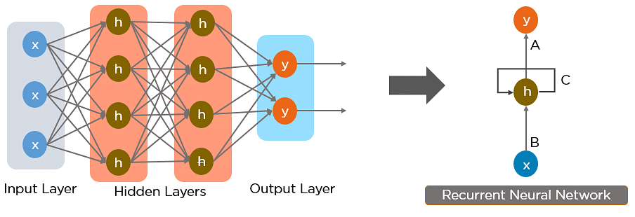

# RNN-notebooks
RNN works on the principle of saving the output of a particular layer and feeding this back to the input in order to predict the output of the layer.

Below is how you can convert a Feed-Forward Neural Network into a Recurrent Neural Network:

The nodes in different layers of the neural network are compressed to form a single layer of recurrent neural networks. A, B, and C are the parameters of the network.

Here, “x” is the input layer, “h” is the hidden layer, and “y” is the output layer. A, B, and C are the network parameters used to improve the output of the model. At any given time t, the current input is a combination of input at x(t) and x(t-1). The output at any given time is fetched back to the network to improve on the output.

In Recurrent Neural networks, the information cycles through a loop to the middle hidden layer.

## Dataset Used 

##### RNN-SineWave
- Here we havent used any dataset, instead we generated sinwave on y-axis for continuous running x-axis.

